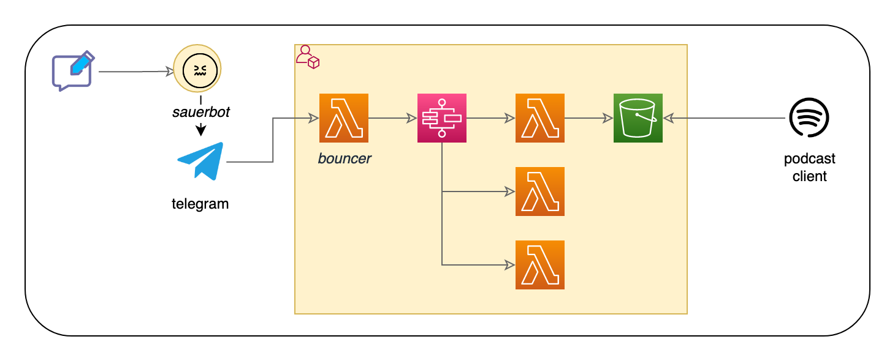

# SauerPod (WIP)
A grumpy telegram bot that downloads videos to S3 and publishes them as an audio podcast.

## Development setup (WIP)
### Ramp Up
The following steps are required for an initial setup.
#### Telegram
* Create bot
    * -> Note `API token` from botfather
* Initiate chat
    * -> Note `chat id` (find out with e.g. @RawDataBot)

#### AWS
* Store secrets in SSM
    * Change & run `./scripts/bootstrap-secrets.sh`
    * Revert changes (to not commit secrete to git)
        * `git restore scripts/bootstrap-secrets.sh`

### Prepare dev environment
* Create/activate venv
* Deploy stack (or `cdk watch`)
* Point bot`s webhook to Lambda
    * Source secrets
        `. ./scripts/get-secrets-from-ssm.sh`
    * Update web url at bot
        `./scripts/update-web-url-at-bot.sh`

## Resources
* https://core.telegram.org/bots/api
* https://xabaras.medium.com/setting-your-telegram-bot-webhook-the-easy-way-c7577b2d6f72
