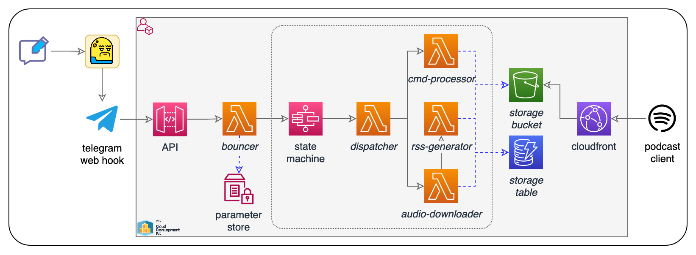

# Sauerpod
A grumpy Telegram bot that converts video streams into audio tracks and publishes those as an individual podcast feed. Implemented in Python using AWS cloud-native services. No servers required.

## Implementation
* [AWS Component Development Kit v2](https://github.com/aws/aws-cdk) (Python)
* [Telegram API](https://core.telegram.org/)
* Serverless AWS:
    * [Amazon API Gateway](https://aws.amazon.com/api-gateway/)
    * [AWS Step Functions](https://aws.amazon.com/step-functions/)
    * [AWS Lambda](https://aws.amazon.com/lambda/)
    * [Amazon S3](https://aws.amazon.com/s3/)
    * [Amazon DynamoDB](https://aws.amazon.com/dynamodb/)
    * [Amazon CloudFront](https://aws.amazon.com/cloudfront/)
    * [AWS Systems Manager](https://aws.amazon.com/systems-manager/)

### Logic Flow

## Development setup (WIP)
### Intial setup
Required once to set up the project:
#### Telegram
* Create bot
    * -> Note `API token` from botfather
* Initiate chat
    * -> Note `chat id` (find out with e.g. @RawDataBot)
#### AWS
* Store secrets in SSM
    * Change values & run `./scripts/bootstrap-secrets.sh`
    * Revert changes in file (to not commit secrets to git)
        * `git restore scripts/bootstrap-secrets.sh`
### Local development
Required for development work:
* Create/activate venv (`. .venv/bin/activate`)
* Configure AWS profile (`export AWS_PROFILE=xyz`)
* Deploy stack (`cdk deploy` or `cdk watch`)
* Point bot`s webhook to Lambda
    * **Source**(!) secrets (don't execute the script)
        `. ./scripts/get-secrets-from-ssm.sh`
    * Update web url at bot
        `./scripts/update-web-url-at-bot.sh`

## Resources
* https://core.telegram.org/bots/api
* https://xabaras.medium.com/setting-your-telegram-bot-webhook-the-easy-way-c7577b2d6f72

## Disclaimer and Credits
* 'Grumpy bot' icons by [www.flaticon.com](https://www.flaticon.com/).
* Sauerpod is meant as a POC to demonstrate the power and elegance of cloud-native Python development. It uses uses [pytube](https://github.com/pytube/pytube) to download audio streams of videos and temporarily store them in a private S3 bucket. It must not be used to share any copyright-protected media.
